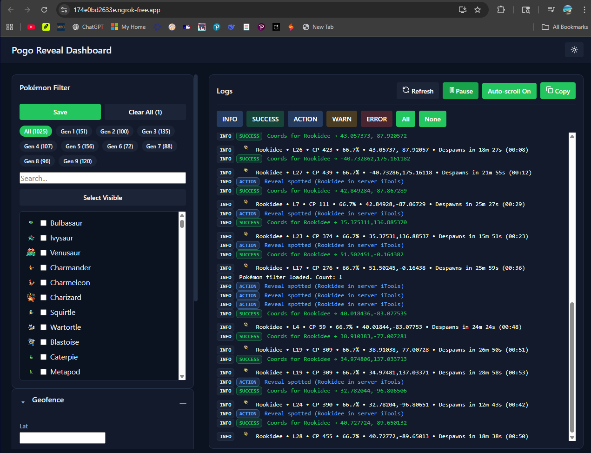
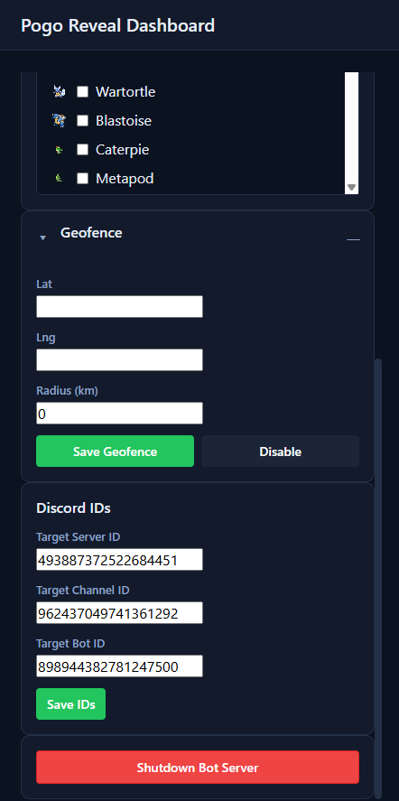

Pogo "Reveal" Self‑Bot




[Watch the demo](assets/demo1.MP4)


A Discord self‑bot for Pokémon GO players. It auto‑clicks "Reveal" buttons in a target channel, extracts coordinates, optionally filters by geofence, and pushes deep‑link alerts via ntfy — all from a clean React dashboard.

## Overview
- Robust Discord self‑bot with smart "Reveal" handling
- Real‑time log viewer and filtering
- Geofence support (center + radius)
- ntfy push notifications with Pokémon sprite icons
- React dashboard with Pokémon filter and controls
- Remote access options: Ngrok or Cloudflare Tunnel

## Quick Start
1) Clone your fork
```
git clone https://github.com/your-username/your-repo.git
cd your-repo
```

2) Root `.env`
```
DISCORD_TOKEN=YOUR_DISCORD_TOKEN
NTFY_TOPIC=YOUR_NTFY_TOPIC
API_PORT=4000
# Optional: geofence
GEOFENCE_CENTER=37.7749,-122.4194
GEOFENCE_RADIUS_KM=5
```

3) Frontend `.env` (in `frontend/`)
```
DANGEROUSLY_DISABLE_HOST_CHECK=true
BROWSER=none
PORT=3000
# If using Cloudflare two‑host setup, set your API host
# REACT_APP_API_BASE=https://api.yourdomain.tld
```

4) Windows — easiest way
- Double‑click `start.bat`. It launches backend (port 4000) and frontend (port 3000).

5) Manual run (all platforms)
- Terminal A (backend)
```
node Server-bot.js
```
- Terminal B (frontend)
```
cd frontend
npm install
npm start
```

Open http://localhost:3000

## Remote Access (optional)
- Ngrok: `ngrok http 3000` for the UI. Keep your backend local or expose separately.
- Cloudflare Tunnel (recommended, stable URL): map
  - `dash.yourdomain` → `http://localhost:3000`
  - `api.yourdomain` → `http://localhost:4000`
  Then set `REACT_APP_API_BASE=https://api.yourdomain` for production builds.

## Dashboard Guide
- Pokémon Filter: Select by Gen or search; Save to apply.
- Geofence: Set lat,lng and radius (km); Save to apply.
- Discord IDs: Enter Bot ID, Server ID, Channel ID (stored locally).
- Logs: Live stream; filter by INFO/SUCCESS/ACTION/WARN/ERROR.
- Shutdown: Sends a shutdown request to the backend.

## Configuration
Required environment variables (root `.env`):

| Variable             | Description                                           |
| -------------------- | ----------------------------------------------------- |
| `DISCORD_TOKEN`      | Your Discord self‑bot token                           |
| `NTFY_TOPIC`         | ntfy topic name for push alerts                       |
| `API_PORT`           | HTTP port for backend (default 4000)                  |


UI‑controlled (persisted by the app):

| Variable            | Description                                           |
| ------------------- | ----------------------------------------------------- |
| `TARGET_SERVER_ID`  | Discord server to monitor                             |
| `TARGET_CHANNEL_ID` | Channel containing "Reveal" messages                  |
| `TARGET_BOT_ID`     | Bot that posts the "Reveal" button                    |
| `GEOFENCE_CENTER`   | `lat,lng` center (omit to disable)                    |
| `GEOFENCE_RADIUS_KM`| Radius in km (0 disables)                             |

Frontend (in `frontend/.env`):

| Variable               | Description                                         |
| ---------------------- | --------------------------------------------------- |
| `PORT`                 | CRA dev‑server port (3000)                          |
| `DANGEROUSLY_DISABLE_HOST_CHECK` | Allow external hostnames in dev           |
| `BROWSER`              | `none` to prevent auto‑open                         |
| `REACT_APP_API_BASE`   | Optional absolute API base (Cloudflare, etc.)       |

## ntfy Setup
1. Create a topic at https://ntfy.sh (or self‑hosted).
2. Install the mobile app and subscribe to your topic.
3. Put the topic name into `NTFY_TOPIC` in the root `.env`.

## Troubleshooting
- Frontend 502 via tunnel: ensure the React dev server is actually on port 3000.
- Dev server not starting: run `npm install` in `frontend/`; use Node 18+.
- Port already in use: free it or change `PORT` to 3001 and adjust your tunnel.
- Cloudflare 404: ensure your ingress/public‑hostname mapping includes a final `http_status:404` catch‑all and host rules are correct.
- Images not loading on GitHub: paths are case‑sensitive; this README uses `assets/RevampedUI.png` and `assets/Uifilterrevamped.png`.

## Contributing
1. Fork this repository
2. Create a branch: `git checkout -b feature/my-feature`
3. Commit: `git commit -m "feat: add my feature"`
4. Push: `git push origin feature/my-feature`
5. Open a Pull Request

## License
MIT License

---
Built with ❤️ by Shrek

