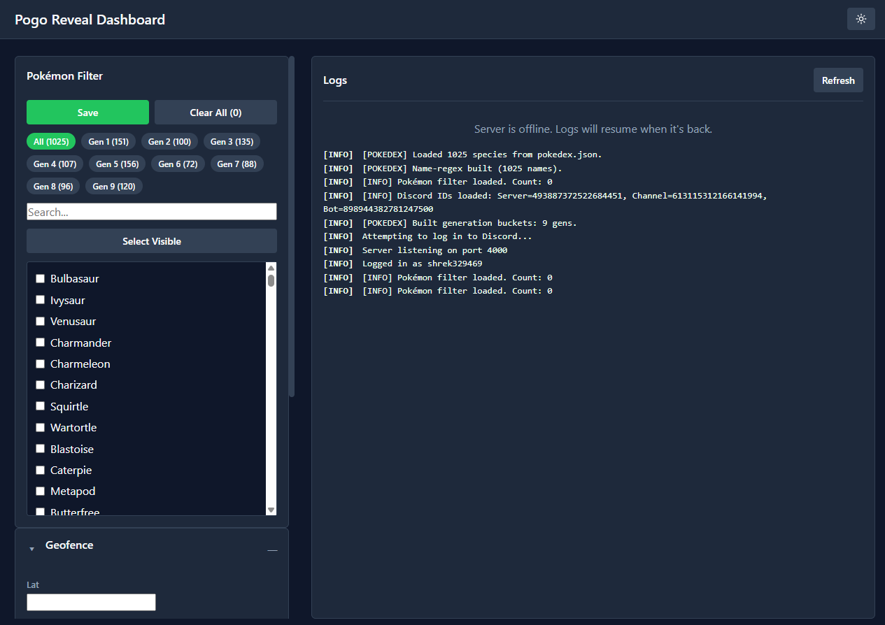
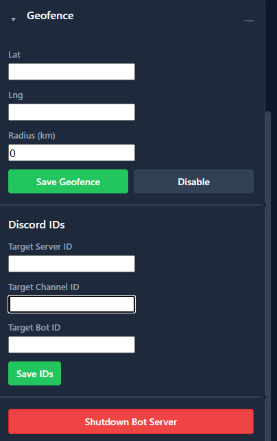

Pogo "Reveal" Self-Bot
 



A Discord self-bot designed for Pokémon GO players. It auto-clicks "Reveal" buttons in a specific channel, grabs geocoordinates, optionally filters based on a geofence, and sends alerts using ntfy. Great for real-time spawn tracking.

## 🚀 Features

   **1.Auto-clicks Discord "Reveal" buttons**

   **2.Extracts lat/lng from button data or ephemeral replies**

   **3.Geofence support (filter alerts by radius)**

   **4.Sends deep-link push alerts via ntfy**

   **5.Fully configurable via a user-friendly UI**

   **6.Built-in React dashboard**

   **7. Ngrok integration for remote access**

## 📦 Installation

1. **Clone** your fork:

   ```bash
   git clone https://github.com/your-username/your-repo.git
   cd your-repo
   ```
2. **Install** dependencies:

   ```bash
   npm install discord.js-selfbot-v13 node-fetch dotenv
   ```

3. **Environment Variables**

   Create a .env file in the root folder:

   ```env
   DISCORD_TOKEN=YOUR_DISCORD_TOKEN
   NTFY_TOKEN=YOUR_NTFY_TOPIC
   API_PORT=4000
   REACT_APP_API_BASE=http://LAN_IP:4000
   NGROK_AUTHTOKEN=
   ```
   
   And a .env file in /frontend:

   ```env
   DANGEROUSLY_DISABLE_HOST_CHECK=true
   BROWSER=none
   ```
🔔 **ntfy Setup**

Visit ntfy.sh and make an account Download the app on your phone

Set up your topic and insert it into .env as NTFY_TOKEN

**🌐 Ngrok Setup**

Go to ngrok.com and create an account Download and install ngrok

Get your authtoken and place it in .env

## 🧠 Running the Bot

**💡 Easy Way (Windows)**

Just double-click the start.bat file — it launches both backend and frontend.
You can also create a desktop shortcut for convenience.

**🛠 Manual Way (All Platforms)**

Use two terminals:

Terminal 1 (Backend)

node Server-bot.js

Terminal 2 (Frontend)

cd frontend
npm start

## 🖥️ Dashboard Guide

Pokémon Filter: Select Pokémon by Gen tab or search bar. Click save.

Geofence: Input coordinates + radius and click save.

Discord IDs: Set Bot ID, Server ID, Channel ID.

Logs: Automatically updates as the bot runs.

Shutdown: Use UI shutdown button, then close the terminal.


## ⚙️ Configuration

| Variable             | Description                                          |
| -------------------- | ---------------------------------------------------- |
| DISCORD_TOKEN      | Your Discord self‑bot token                          |
| NTFY_TOKEN         | Your ntfy.sh topic name                            |
| GEOFENCE_CENTER    | lat,lng center for radius filter (omit to disable) |
| GEOFENCE_RADIUS_KM | Radius in km (set to 0 to disable geofencing)      |
| TARGET_SERVER_ID   | ID of the Discord server to monitor (UI)             |
| TARGET_CHANNEL_ID  | ID of the channel where "Reveal" messages appear (UI)|
| TARGET_BOT_ID      | ID of the bot that posts the "Reveal" button   (UI)  |

🤝 Contributing

Fork this repository

Create your branch: git checkout -b feature/my-feature

Commit changes: git commit -m "feat: add my feature"

Push to your fork: git push origin feature/my-feature

Open a Pull Request

📄 License

Licensed under the MIT License.

Built with ❤️ by Shrek

