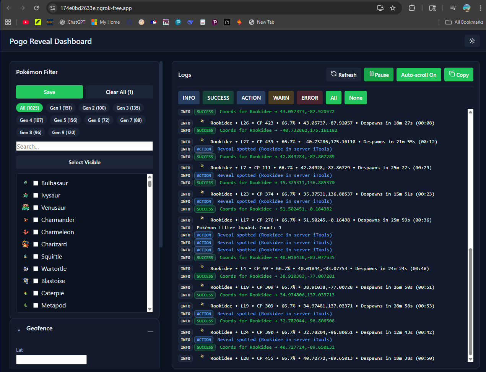
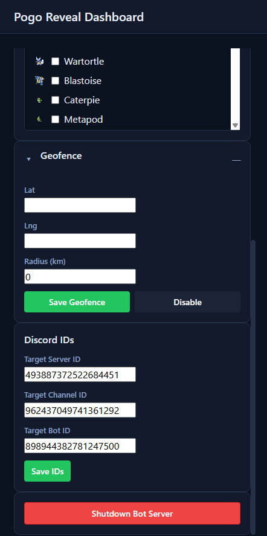

Pogo "Reveal" Self-Bot

> Last updated: March 2026




[Watch the demo](assets/demo1.MP4)


A Discord self-bot for Pokemon GO players. It auto-clicks "Reveal" buttons in a target channel, extracts coordinates, optionally filters by geofence, queues them, and lets you dispatch the newest coordinate on demand to a location API endpoint from a clean React dashboard.

## Overview
- Robust Discord self-bot with smart "Reveal" handling
- Real-time log viewer and filtering
- Geofence support (center + radius)
- Manual queue dispatch to a location spoofing API (`POST /location`)
- React dashboard with Pokemon filter and controls
- Remote access options: Ngrok or Cloudflare Tunnel

## Quick Start
1) Clone your fork
```
git clone https://github.com/your-username/your-repo.git
cd your-repo
```

2) Root `.env`
```
DISCORD_TOKEN=YOUR_DISCORD_TOKEN
API_PORT=4000
TARGET_SERVER_ID=YOUR_SERVER_ID
TARGET_CHANNEL_ID=YOUR_CHANNEL_ID
TARGET_BOT_ID=YOUR_BOT_ID

# Optional: location dispatch endpoint
LOCATION_POST_URL=http://127.0.0.1:8001/location
LOCATION_CLIENT_ID=ios-app
LOCATION_ALTITUDE=10
LOCATION_SPEED_KNOTS=0
LOCATION_HEADING=0
LOCATION_QUEUE_MAX=500
LOCATION_QUEUE_PRUNE_INTERVAL_MS=10000

# Startup backfill behavior
STARTUP_REVEAL_BACKFILL_LIMIT=5
STARTUP_REVEAL_BACKFILL_DELAY_MS=250

# Optional geofence
GEOFENCE_CENTER=37.7749,-122.4194
GEOFENCE_RADIUS_KM=5
```

3) Frontend `.env` (in `frontend/`)
```
DANGEROUSLY_DISABLE_HOST_CHECK=true
HOST=0.0.0.0
BROWSER=none
PORT=3000
# If using Cloudflare two-host setup, set your API host
# REACT_APP_API_BASE=https://api.yourdomain.tld
```

4) Windows - easiest way
- Double-click `start.bat`. It launches backend (port 4000) and frontend (port 3000).

4b) Linux/macOS - convenience script
- Run `./start.sh` to launch backend and frontend. Requires `node` and `npm`. Then open `http://localhost:3000` in your browser.

5) Manual run (all platforms)
- Terminal A (backend)
```
node Server-bot.js
```
- Terminal B (frontend)
```
cd frontend
npm install
npm start
```

Open http://localhost:3000

## Remote Access (optional)
- Ngrok: `ngrok http 3000` for the UI. Keep your backend local or expose separately.
- Cloudflare Tunnel (recommended, stable URL): map
  - `dash.yourdomain` -> `http://localhost:3000`
  - `api.yourdomain` -> `http://localhost:4000`
  Then set `REACT_APP_API_BASE=https://api.yourdomain` for production builds.

## Dashboard Guide
- Pokemon Filter: Select by Gen or search; Save to apply.
- Geofence: Set lat,lng and radius (km); Save to apply.
- Discord IDs: Enter Bot ID, Server ID, Channel ID (stored locally).
- Location Queue: incoming coords are queued; press Next to send the newest queued location to `LOCATION_POST_URL`.
- Queue prune is based on each entry's `despawnEpoch` from reveal data (plus coordinate dedupe).
- On startup: bot also processes the most recent reveal messages (default 5) to prefill queue.
- Updating Discord IDs via API/UI also triggers a fresh backfill pass.
- Logs: Live stream; filter by INFO/SUCCESS/ACTION/WARN/ERROR.
- Shutdown: Sends a shutdown request to the backend.

## Configuration
Root `.env` variables:

| Variable | Description |
| ----------------------------- | ----------------------------------------------------- |
| `DISCORD_TOKEN` | Your Discord self-bot token |
| `API_PORT` | HTTP port for backend (default 4000) |
| `TARGET_SERVER_ID` | Discord server ID to monitor |
| `TARGET_CHANNEL_ID` | Discord channel ID to monitor |
| `TARGET_BOT_ID` | Discord bot/user ID to accept messages from |
| `LOCATION_POST_URL` | Full URL for location dispatch endpoint |
| `LOCATION_CLIENT_ID` | Client id passed to location API (default `ios-app`) |
| `LOCATION_ALTITUDE` | Optional altitude sent with location payload |
| `LOCATION_SPEED_KNOTS` | Optional speed sent with location payload |
| `LOCATION_HEADING` | Optional heading sent with location payload |
| `LOCATION_QUEUE_MAX` | Maximum in-memory queue size before oldest is dropped |
| `LOCATION_QUEUE_PRUNE_INTERVAL_MS` | Active queue prune interval (ms) |
| `STARTUP_REVEAL_BACKFILL_LIMIT` | Number of recent messages to process at startup |
| `STARTUP_REVEAL_BACKFILL_DELAY_MS` | Delay between startup reveal clicks (ms) |
| `GEOFENCE_CENTER` | Optional geofence center (`lat,lng`) |
| `GEOFENCE_RADIUS_KM` | Optional geofence radius in km |

Frontend (in `frontend/.env`):

| Variable | Description |
| ---------------------- | --------------------------------------------------- |
| `PORT` | CRA dev-server port (3000) |
| `HOST` | Bind host for remote access (`0.0.0.0`) |
| `DANGEROUSLY_DISABLE_HOST_CHECK` | Disable host-header check for tunneled domains |
| `BROWSER` | `none` to prevent auto-open |
| `REACT_APP_API_BASE` | Optional absolute API base (Cloudflare, etc.) |

## Troubleshooting
- Frontend invalid host header: ensure `frontend/.env` has `DANGEROUSLY_DISABLE_HOST_CHECK=true` and restart frontend.
- Frontend 502 via tunnel: ensure the React dev server is actually on port 3000.
- Dev server not starting: run `npm install` in `frontend/`; use Node 18+.
- Port already in use: free it or change `PORT` to 3001 and adjust your tunnel.
- Cloudflare 404: ensure your ingress/public-hostname mapping includes a final `http_status:404` catch-all and host rules are correct.

## Contributing
1. Fork this repository
2. Create a branch: `git checkout -b feature/my-feature`
3. Commit: `git commit -m "feat: add my feature"`
4. Push: `git push origin feature/my-feature`
5. Open a Pull Request

## License
MIT License

---
Built with heart by Shrek
